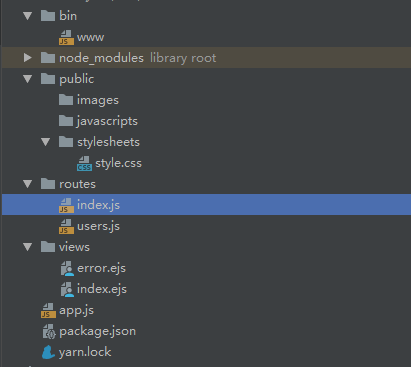
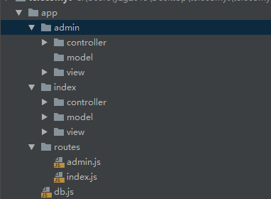

### 构建项目
+ 安装koa-generator
```bash
 yarn global add koa-generator
```
+ 使用koa-generator生成koa2项目 -e为使用ejes为模版
```bash
 koa2  -e projectname 
```
+ 开始项目
```bash
 cd project 
 yarn install
```
>目录结构


### 重构目录
>当然这样的目录显然不符合我们当下的开发方式，我们要把它变成我们熟悉的MVP模式

+ pulic 目录为资源目录可以不用动
+ bin 目录是重要配置文件也不动
+ 新建app目录并在里面新建模块admin（用于博客后台管理），inde（用于博客正式内容），route（用于管理路由），db.js（用于配置链接数据库参数）
+ 在每个模块都新建controller，model， view 目录这样mvc模型就出来了
+ 删除其他目录及里面的文件
 


### 配置文件

